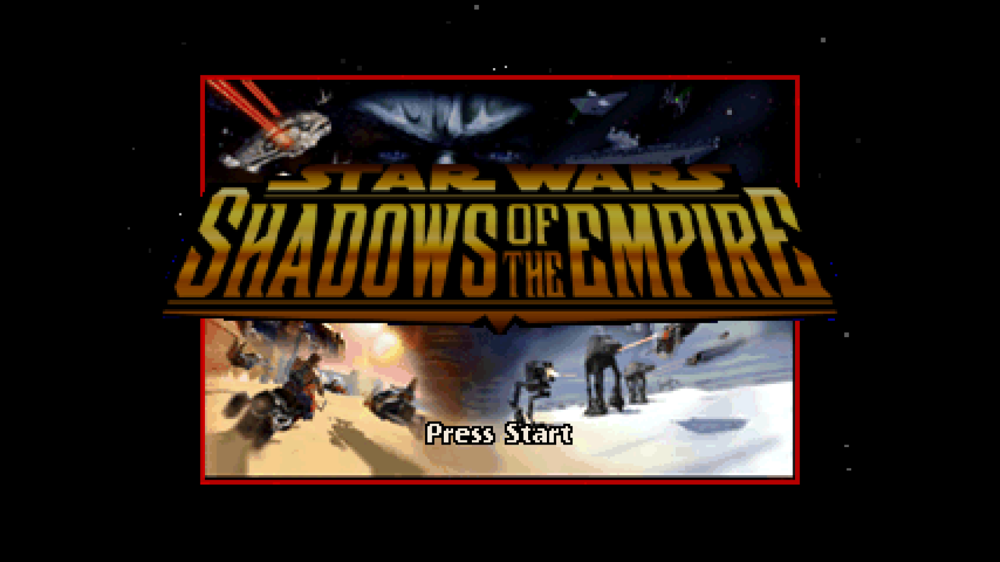
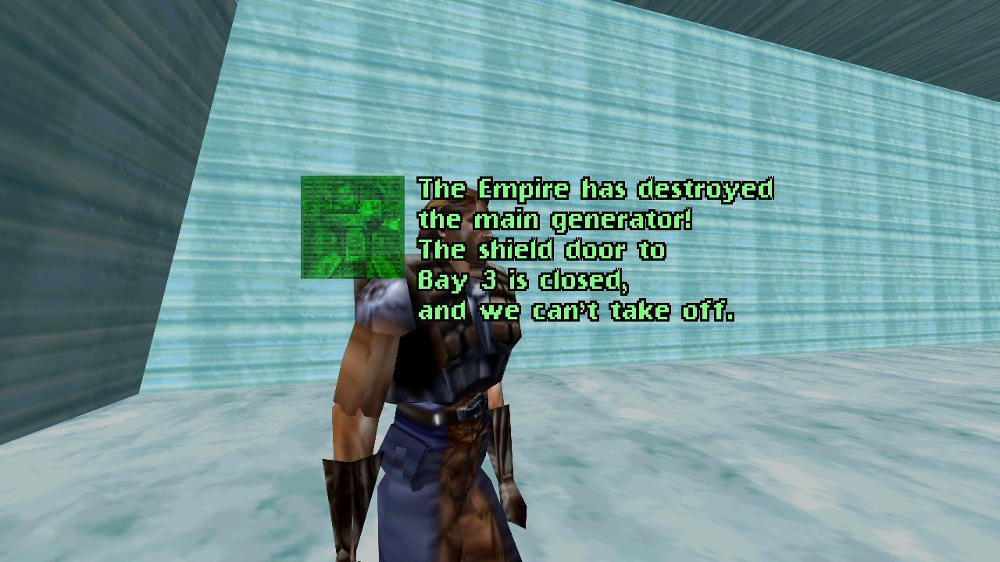
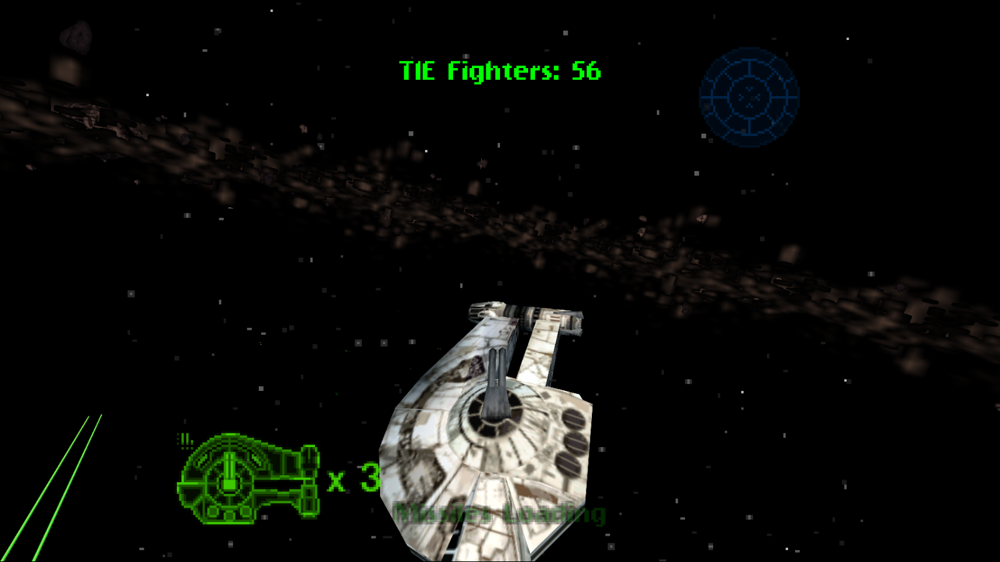
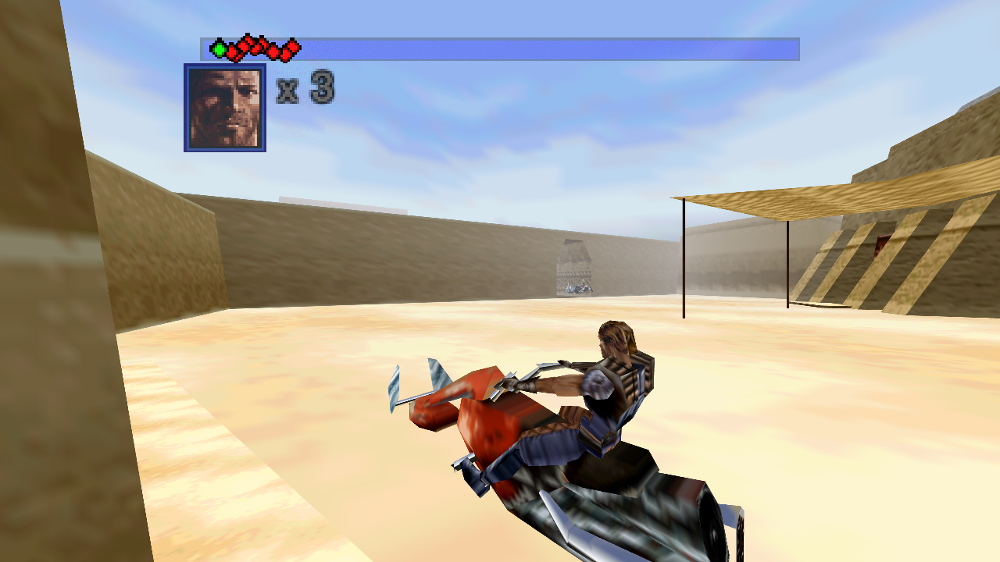

# Shadows of the Empire: Recompiled

This repository contains a playable Windows static recompilation of the
Nintendo 64 version of *Star Wars: Shadows of the Empire* using N64Recomp.

## Screenshots

| Main menu | On-foot level |
| --- | --- |
|  |  |

| Space level | Speeder bike level |
| --- | --- |
|  |  |

## Target

- Region: USA
- Retail revision: 1.2
- ROM byte order: big-endian (`.z64`); byteswapped `.v64`/`.n64` dumps
  are converted automatically
- Internal ROM name: `Shadow of the Empire`
- Accepted ROM SHA-256, either of:
  - `e7085e013123537f34e0edec8801318016da4dbac424172d6dc5f3b67d98642c`
    (No-Intro `Star Wars - Shadows of the Empire (USA) (Rev 2)`, CRC32
    `E8727549` - the normal cartridge dump)
  - `2802bf4135842f7c8d254349ed7ac2641f6d7ff45e9d2d01304e1455706dd103`
    (a widely mirrored pack copy; differs from the dump above only at ROM
    offset `0x3B7B6E`, which falls outside every recompiled code section,
    the texture pool and all 32 packed segments, so it runs identically)

No game ROMs or extracted copyrighted assets belong in version control. A
legally obtained matching ROM is required locally to build and run the port.

## Status

The 0.9 beta is playable on Windows. Graphics, music and sound effects,
keyboard and controller input, rumble, EEPROM saves, widescreen rendering,
MSAA, and the in-game graphics/options hooks are connected. Automated crash
testing navigates the in-game Change Level menu and has exercised all ten
levels. Longer input-driven runs cover on-foot, speeder bike, spacecraft,
turret, and jetpack gameplay paths.

Public release packages contain the executable, required runtime DLLs, and
configuration files only. They do not include a ROM, `main.bin`, saves, the
`Sdata` folder, texture dumps, texture packs, or other extracted game data.
At runtime, the executable validates the user's local USA v1.2 big-endian ROM
and reconstructs the retail executable image in memory.

The renderer includes the game's F3DBETA microcode identification and
perspective-normalization behavior. It also avoids RT64's early-present path,
which caused alternating black frames and severe flicker in this game.
Consecutive synchronized offscreen captures of menus and Hoth gameplay no
longer contain those black frames.

The retail loader also restores libultra's 46.875 MHz CPU-counter clock rate.
The generic runtime replacement for `osInitialize` does not perform that
guest-memory write; leaving the ROM's 62.5 MHz initializer unchanged made
SOTE's audio scheduler run 25 percent late and repeatedly underrun.

Gameplay is paced at one update per 60 Hz VI while the N64 VI and
host presentation remain at 60 Hz. Without this guard, HLE graphics tasks
finish much faster than the original RSP/RDP work and let the main loop run
about 120 gameplay updates per second. That made movement, collision, and
mission timers several times too fast even though presentation itself was
properly synchronized.

## Requirements

For the release zip:

- Windows 10 or 11
- A legally obtained ROM matching the SHA-256 above

For building from source:

- Windows 10 or 11
- Visual Studio 2022 with **Desktop development with C++**
- CMake and Git on `PATH`
- Python 3
- A legally obtained ROM matching the SHA-256 above

Install the one Python dependency into the repository:

```powershell
python -m pip install --target .tools/python -r tools/requirements.txt
```

## Build

Place the ROM in the repository root with this name:

```text
Star Wars - Shadows of the Empire (U) (V1.2) [!].z64
```

Then run:

```powershell
powershell -ExecutionPolicy Bypass -File .\build.ps1
```

Use `-RomPath C:\path\to\rom.z64` for a ROM stored elsewhere. The first build
extracts and recompiles the game. Later builds reuse those generated sources;
pass `-Regenerate` to recreate them or `-Clean` to recreate both CMake build
trees.

## Run

For the release zip, extract the archive and place the matching ROM next to
`Shadows of the Empire.exe` with either of these names:

```text
sote.us.v1.2.z64
Star Wars - Shadows of the Empire (U) (V1.2) [!].z64
```

For local builds, the build script creates the same self-contained play
folder:

```text
SotE_Recompiled\
```

Double-click:

```text
SotE_Recompiled\Shadows of the Empire.exe
```

The executable resolves the ROM, retail image, DLLs, and saves from its own
directory, so it does not depend on the current working directory or the
repository layout. The portable folder can be moved as a unit. Saves are
written under:

```text
SotE_Recompiled\saves\sote.us.v1.2.bin
```

Normal double-click launches also keep diagnostics for the most recent run:

```text
SotE_Recompiled\logs\sote-latest.log
SotE_Recompiled\logs\sote-latest-errors.log
```

The first file includes bike-stage timers, lives, and mission-failure
transitions. The second captures runtime errors and native crash stacks. Both
files are replaced on the next launch instead of accumulating indefinitely.

Normal launches use Direct3D and sound. `--muted` suppresses the host audio
device while leaving guest audio generation active. Automation uses both
`--headless-smoke` and `--muted`, so it opens neither a Direct3D window nor a
sound device.

## Graphics

Normal launches default to a resizable 1280x720 widescreen window, automatic
integer-scaled internal resolution, and 4x MSAA. Maximizing the window or
moving it to a higher-resolution display automatically raises the internal
rendering resolution. RT64 expands supported 3D projections to the window's
aspect ratio while retaining the game's original 2D framebuffer behavior.

Graphics configuration is part of the original game UI. Open
`Options` -> `Graphics` to select:

- An actual output resolution supported by the current display
- Native, 2x, 4x, or 8x render scale, or automatic Scale to Fit
- Original 4:3 or Widescreen presentation
- Off, 2x, 4x, or 8x MSAA
- Windowed or Borderless display mode

Changes are staged until `Apply` is selected. `Reset` restores 1280x720,
Scale to Fit, Widescreen, 4x MSAA, and Windowed mode. Renderer options are
saved in `SotE_Recompiled\rt64.json`; output resolution and display mode are
saved in `SotE_Recompiled\sote_options.json`. Both files are created
automatically.
Pressing `F11` or `Alt+Enter` also toggles borderless mode and keeps the
in-game setting synchronized.

The bundled RT64 revision provides multisample antialiasing rather than FXAA.
The port defaults to 4x MSAA because it smooths polygon edges without applying
a full-screen blur to HUD text and textures.

On an Xbox controller, Y is a digital alias for N64 C-left. In the jetpack
levels, press Y to toggle the jetpack and hold A for thrust. The right-stick
left direction continues to provide the original C-left input as well.

## Automated crash smoke

Run the four mode-focused tests:

```powershell
powershell -ExecutionPolicy Bypass -File .\tools\smoke_levels.ps1
```

Run every Change Level entry:

```powershell
powershell -ExecutionPolicy Bypass -File .\tools\smoke_levels.ps1 -AllLevels
```

Each level test spends three minutes in its gameplay observation window by
default. It records life loss, result transitions, and game-over state along
with periodic level heartbeats. Use `-DurationMinutes` to request a different
duration. Unless `-Passive` is supplied, the harness rotates through all four
analog directions while holding fire and pulses A, B, R, L, and each C button.
The combined-input test fails if any of those action classes is absent from
the captured runtime log. Pass `-NoRefillLives` to exercise natural life
depletion instead of the default long-smoke refill. Add
`-ExpectNaturalGameOver` to require the exact four-death sequence
`3→2→1→0→-1` and a result-4 return to the level menu.

These tests use the headless renderer so they can run without taking window
focus. They also pass `--muted`, while still exercising game audio tasks,
overlay code, and display-list submission paths; rendered offscreen capture
remains a separate validation step. Every run starts from an isolated copy of
the known-good Change Level save under `build\diagnostics` and does not modify
the normal save.

## Controls

An SDL-compatible controller uses the expected N64 layout:

- Left stick: N64 analog stick
- A / B: N64 A / B
- Left trigger: Z
- Left and right shoulder buttons: L and R
- Right stick: C buttons
- D-pad and Start: N64 D-pad and Start

Keyboard controls:

- `WASD`: analog stick
- `Z` or Space: A
- `X`: B
- `C`: Z
- `Q` / `E`: L / R
- Arrow keys: D-pad
- `IJKL`: C buttons
- Enter: Start

Physical keyboard and controller input is accepted only while the game window
has focus. This prevents normal desktop typing from steering an unattended
game.

### Control scheme

The injected Options entry cycles between `Graphics` and `Controls` with Left
and Right. The `Controls` submenu offers a single player-facing choice:

- `Classic` - the original N64 mapping described above.
- `Modern` - controller-focused aiming, movement, and vehicle tuning.
  Speeder-bike stages use right trigger for throttle, left trigger for brake,
  left stick steering, and right shoulder fire. Bike steering uses a
  progressive curve, can lose sensitivity as throttle rises, and is lightly
  stabilized.

Highlight `Apply` to persist the choice to `sote_controls.json` next to the
executable.

Modern-control tuning is kept in `CONTROLS_MODERN.INI` next to the
executable. The file is written with defaults on first run and re-read when it
changes on disk. Each setting has comments describing its valid range and what
higher or lower values do. Tunables include movement deadzone and sensitivity,
aim deadzone and sensitivity, trigger deadzone and sensitivity, optional
look-forward snap back, and speeder-bike steering curve, high-speed falloff,
minimum steering scale, stabilization, camera smoothing, and fire binding.

Beta testers are encouraged to tune `CONTROLS_MODERN.INI` for real controllers
and submit the best-feeling setups with controller model details.

### Control-scheme harness

The scheme selection, the `CONTROLS_MODERN.INI` reader, and the Modern input
math run outside the recompiled guest, so they are covered by a host-side
harness that needs neither a ROM nor a graphics device:

```powershell
.\build\runtime\Release\controls_harness.exe
```

The crash smoke above feeds scripted inputs and never reaches the SDL
controller path, so it does not exercise this code.

## Repository notes

Generated game code and ROM-derived data are deliberately ignored. The
dependency changes needed by this port are kept as patch files under
`patches\` and are applied automatically by `build.ps1`.
